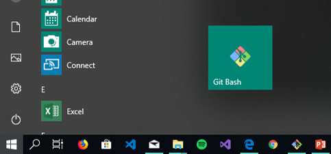
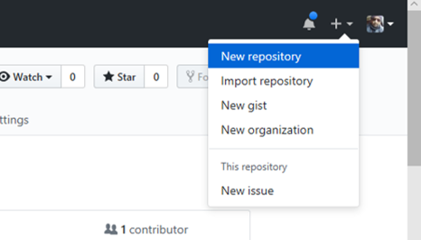
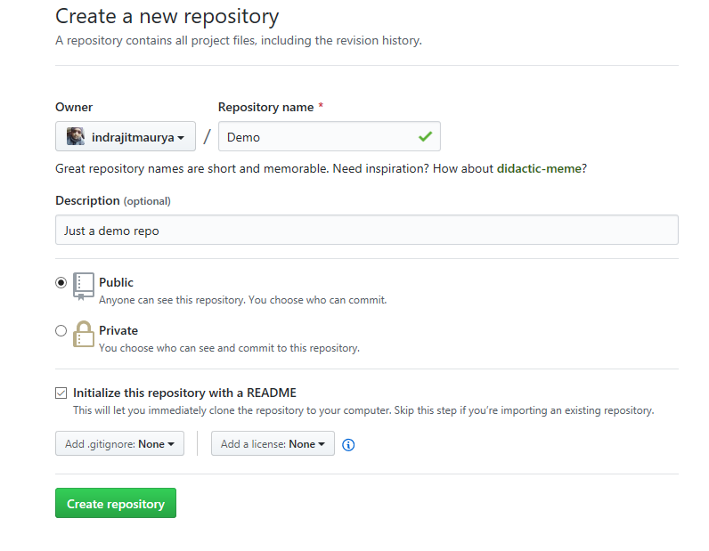
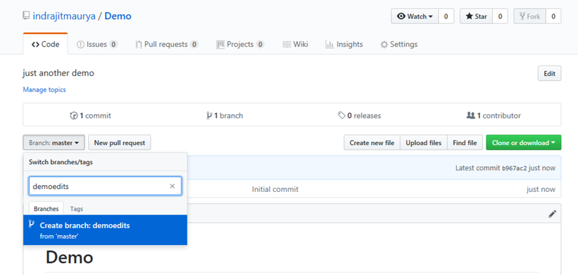
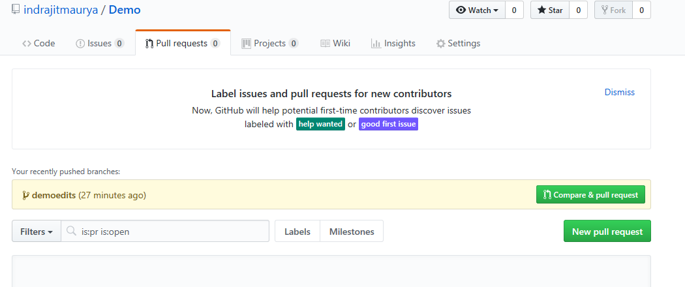
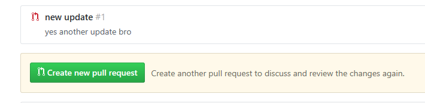

# GitHub HandBook
**[GitHub](http://github.com)** is a development platform for version control and collaboration. It allows you to host and manage your projects and work together on same projects from anywhere.

Well let’s start with a few basics.
## Terminology

| Keyword | Description |
| ---| --- |
| **Repository** | **"Repo"** for shortv is a folder for storing your codes, files, text files, image files, etc. It can be local folder on your computer, or a storage space on GitHub. |
| **Fork** | A copy of someone else's project or repository. Forking makes it possible for you to freely experiment the project **WITHOUT** affecting the original project. |
| **Upstream** | The original repo or Project that you have forked |

Repositories
Branches
Commits
Pull Requests

## [What is Git?](https://www.atlassian.com/git/tutorials/what-is-git)

It is basically a **Version Control System** which helps us to have a multiple versions of our project every point of time to avoid losing or overwriting it.
If you are working together on the same projects then **Git** will help you to:
- Save your codes online.
- See what new changes are made by all developers
- Discuss issues with other developers
- Recovering deleted datas
- Revert accidentally changed data.
- Share and exchange code with other developers easily.
- Backup your code easily to a remote server.
- **And Many more**

## Getting Started

[Download](https://git-scm.com/downloads) and install [Git](https://git-scm.com/downloads)

<table>
  <tr>
    <td>Search for Git Bash
    </td>
    <td> 

       
    

    </td>
  </tr>
  
  <tr>
    <td>Type git --version
    </td>
    <td> 

       
    

    </td>
  </tr>
 
</table>
 

## Sign Up on GitHub

Refer to this [Link](https://github.com/join?source=header-home)

<table>
  <tr>
    <td><strong>Select New Repository</strong>  
    <ul><li>Upper right corner</li>
  <li>Select New repository</li>
    </ul>
    </td>
    <td> 

       
    

    </td>
  </tr>
  
  <tr>
    <td><strong>Create a Repository</strong>  
<ul>
  <li>Name it</li>
  <li>Provide a Short description</li>
  <li>Select Initializewith a README.</li>
      </ul>
    </td>
    <td> 

       
    

    </td>create a new branch
  </tr>
<tr>
  <td colspan="2"><strong><h2>BRANCH</h2></strong>
    

      We use Branching to work on different versions of a repository at one time. The default <strong>BRANCH</strong> is named as <strong>MASTER</strong>. We create new branches which can be said as a copy of Master branch and we do our experiments there before committing them to master. Any changes done in your new branches will not be reflected in your master branch. But if someone made a change in your master branch then you could pull in those updates to your branch. When the code is ready, you can merge all of your branch into master.
    
 
    <td>
 </tr>
   <tr>
    <td> <strong>Create a New Brach</strong>  
<ul>
  <li>Go to your new repository</li>
  <li>Drop down (branch: master)</li>
  <li>Type a branch name</li>
  <li>Select the blue branch box</li>
      </ul>
    </td>
    <td> 

       
    

    </td>
  </tr>
 
 
 <tr>
  <td colspan="2"><strong><h2>COMMIT</h2></strong>
    

     Commits are basically saving your changes. For each commit you can add a commit message and a small description explaining the changes made so that other contributors will understand why you made the change. In short Commits prepares a history of your changes. Thus helping you to see your previous codes.
    
 
    <td>
 </tr>
   <tr>
    <td> <strong>Create Commit</strong>  
<ul>
  <li>Click the README.md file</li>
  <li>Click the  pencil to edit</li>
  <li>Write something</li>
  <li>Add a commit message </li>
  <li>Add a description</li>
   <li>Click Commit changes button.</li>
      </ul>
    </td>
    <td> 

       
    

    </td>
  </tr>
  
  <tr>
   <td colspan="2">
 You have a <strong>MASTER</strong> Branch and <strong>DEMOEDITS</strong> Branch. These changes will be made to just the README file on your <strong>DEMOEDITS</strong> branch and not on your <strong>MASTER</strong> Branch.
 
  </td>
  <tr>
    
   <tr>
  <td colspan="2"><strong><h2>PULL REQUEST</h2></strong>
    

Now it's time for pull request. You can open a pull request in your own repository and then merge it to your master branch. But mainly we use pull request to propose your changes to someone interested. If someone review your code they will pull in your contribution to their branches. You can easily figure out the differences of the content from both branches.
    
 
    <td>
 </tr>
   <tr>
    <td> Click the  Pull Request tab  
    </td>
    <td> 

       
    

    </td>
  </tr>
    <tr>
  <td> In the Example Comparisons box, select the branch you made,  readme-edits, to compare with master (the original).</strong>  
    </td>
    <td> 

       
    

    </td>
  </tr>
  
  <tr>
  <td> VWhen you’re satisfied that  these are the changes you want to  submit, click the big green Create Pull Request button.  
    </td>
    <td> 

       
    

    </td>
  </tr>
    <tr>
    <td> View your changes  
    </td>
    <td> 

       
    

    </td>
  </tr>
    
    
    
    
    
    
    
    
</table>

